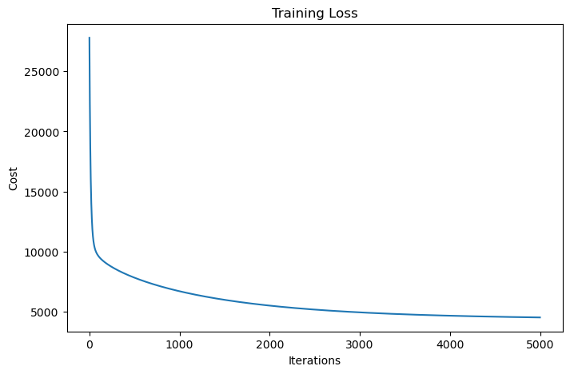

# Bike Sharing Demand Prediction using Linear Regression From Scratch

## 📌 Project Overview

This project was completed as the **first task of my FEDIS AI Internship**.

The main goal of this task was not only to build a Machine Learning model, but to understand how **Linear Regression works from scratch** and learn the main concepts behind the optimization process.

In this project, I implemented Linear Regression without using a ready-made regression model. I built the main components myself, including the **Cost Function, Gradient Computation, and Gradient Descent**, and used them to train the model and evaluate its performance.

I also performed **Exploratory Data Analysis (EDA)** to understand the dataset, discover important patterns, and identify the factors that affect bike rental demand.

## 📊 Dataset

The project uses the **Bike Sharing Dataset**, which contains the hourly and daily number of rental bikes between **2011 and 2012** in the Capital Bikeshare system, along with corresponding weather and seasonal information.

The dataset includes information related to:

* Date and time
* Weather conditions
* Season
* Working days and holidays
* Bike rental counts

The main target of the project is the **total number of bike rentals (`cnt`)**.

## 🎯 Project Objectives

The main objectives of this task were to:

* Understand the structure and characteristics of the dataset through EDA.
* Identify important patterns and relationships within the data.
* Preprocess the data before training.
* Implement **Linear Regression from scratch**.
* Understand and implement the **Cost Function**.
* Compute the **Gradients** manually.
* Implement **Gradient Descent** for model optimization.
* Evaluate the trained model using **MAE** and **R² Score**.
* Understand the limitations of Linear Regression on this type of dataset.

## 🔍 Exploratory Data Analysis

Before building the model, I performed Exploratory Data Analysis (EDA) to understand the dataset and identify the main patterns affecting bike rental demand.

### Key Findings

#### ⏰ Demand by Hour

The hourly demand showed a clear **bimodal pattern**:

- A morning peak around **8 AM**, with approximately **360 rentals/hour**.
- A higher evening peak around **5–6 PM**, reaching approximately **460 rentals/hour**.
- The lowest demand occurs around **3–4 AM**, when demand is close to zero.

This was one of the most important findings because it showed that the relationship between `hr` and bike demand is clearly **non-linear**. :contentReference[oaicite:0]{index=0}

#### 📅 Working Days vs Non-Working Days

Demand behaves differently depending on the type of day.

- **Working days** show two clear peaks around the morning and evening commuting hours.
- **Non-working days** show a broader peak around midday to early afternoon.

This indicates that the interaction between `hr` and `workingday` is important when predicting demand. :contentReference[oaicite:1]{index=1}

#### 🌦️ Weather and Season

Weather conditions have a clear effect on bike rental demand.

- Demand tends to be higher during **warmer seasons** and lower during winter.
- **Clear weather** has the highest demand.
- Severe weather conditions, such as heavy rain or storms, can reduce demand significantly. :contentReference[oaicite:2]{index=2} :contentReference[oaicite:3]{index=3}

#### 📦 Outliers

The boxplot showed many values above the upper whisker, especially above approximately **650 rentals/hour**.

However, these values were **not removed**, because they represent real rush-hour demand rather than data errors or random noise. :contentReference[oaicite:4]{index=4}

#### 📈 Target Distribution

The distribution of `cnt` is **right-skewed**. Most hours have relatively low demand, while a smaller number of hours contain very high rental counts reaching close to 977.

This long tail is mainly associated with the sharp demand increases during rush hours. :contentReference[oaicite:5]{index=5}

## ⚙️ Data Preprocessing

After exploring the data, I prepared the features for training the Linear Regression model.

### 🧹 Data Cleaning

The dataset contained **17,379 rows and 17 columns**, with no missing values, so no imputation was required. :contentReference[oaicite:0]{index=0}

### 🔄 Feature Preparation

Categorical features were converted into numerical representations using **One-Hot Encoding** so they could be used by the regression model.

### ✂️ Train/Test Split

Since the dataset represents hourly observations over time, I used a **chronological 80/20 split**:

- **80%** of the earliest observations → Training set
- **20%** of the latest observations → Test set

This approach prevents future information from leaking into the training data and provides a more realistic evaluation for a time-dependent prediction problem. :contentReference[oaicite:1]{index=1}

### 📏 Feature Standardization

The numerical features were standardized using the mean and standard deviation calculated **only from the training data**.

The same training statistics were then applied to the test set to avoid data leakage.

Standardization was especially important for Gradient Descent because the features have different scales. Putting them on a similar scale helps the optimization process converge faster and more stably. :contentReference[oaicite:2]{index=2}

## 🧠 Linear Regression From Scratch

Instead of using a ready-made Linear Regression implementation, I built the model from scratch to understand the mathematics and optimization process behind it.

### 1. Model Prediction

The model predicts the target using the linear equation:

$$
\hat{y} = Xw + b
$$

where:

- `X` = input features
- `w` = model weights
- `b` = bias
- `ŷ` = predicted value

### 2. Cost Function — Mean Squared Error

To measure how far the predictions are from the actual values, I implemented the **Mean Squared Error (MSE)** cost function:

$$
J(w,b) = \frac{1}{2m}\sum_{i=1}^{m}(\hat{y}_i-y_i)^2
$$

The cost function gives us a measure of the model's prediction error, which Gradient Descent tries to minimize. :contentReference[oaicite:0]{index=0}

### 3. Gradient Computation

I then implemented the gradients of the cost function with respect to the weights and bias:

$$
\frac{\partial J}{\partial w}
=
\frac{1}{m}X^T(\hat{y}-y)
$$

$$
\frac{\partial J}{\partial b}
=
\frac{1}{m}\sum(\hat{y}-y)
$$

These gradients determine the direction in which the weights and bias should be updated to reduce the prediction error.

The calculations were fully vectorized using matrix multiplication instead of explicit loops. :contentReference[oaicite:1]{index=1}

### 4. Gradient Descent

Gradient Descent was used to iteratively update the model parameters in the opposite direction of the gradient:

$$
w := w - \alpha \frac{\partial J}{\partial w}
$$

$$
b := b - \alpha \frac{\partial J}{\partial b}
$$

At every iteration, the current cost was recorded so that the training process could be monitored through the cost curve. :contentReference[oaicite:2]{index=2}

### 5. Training and Tuning

The model was initially trained for **1,000 iterations**, but the cost was still decreasing at the end of training, indicating that the model had not fully converged.

I then experimented with increasing the learning rate and the number of iterations. Increasing the learning rate too much caused **overshooting**, where the cost initially decreased but then started increasing again.

The final configuration used:

- **Learning Rate (`alpha`) = 0.01**
- **Iterations = 5,000**

This resulted in a stable and continuously decreasing cost curve and improved the final model performance. :contentReference[oaicite:3]{index=3}

## 📈 Model Results

After improving the training process, the final Linear Regression model achieved:

| Metric | Before (1,000 iterations) | After (5,000 iterations) |
|---|---:|---:|
| **MAE** | 126.02 | **104.53** |
| **R² Score** | 0.40 | **0.60** |

The final model explains approximately **60% of the variance** in bike rental demand, while the average prediction error is approximately **104.5 rentals/hour**.

Increasing the number of iterations and fixing the convergence issue resulted in a significant improvement in performance. :contentReference[oaicite:4]{index=4}

### 📉 Cost Function Convergence

The cost decreased from approximately **27,796** at the beginning of training to approximately **4,523** after 5,000 iterations, showing that the model successfully converged during training.

