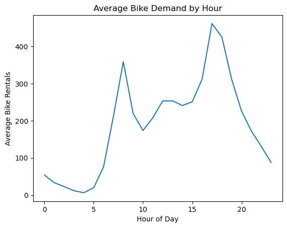
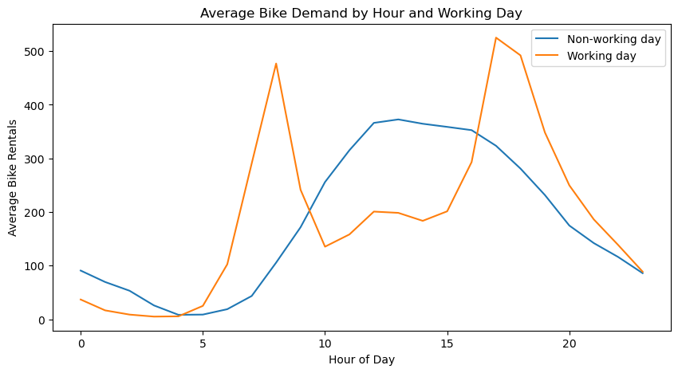
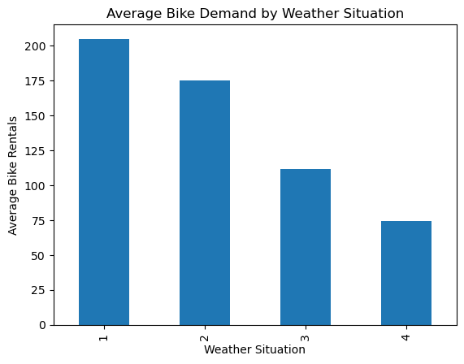
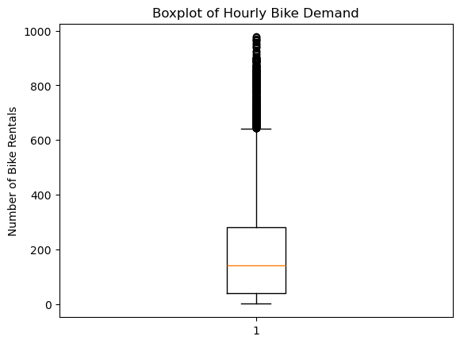

# Bike Sharing Demand Prediction using Linear Regression From Scratch

## 📌 Project Overview

This project was completed as the **first task of my FEDIS AI Internship**.

The main goal of this task was not only to build a Machine Learning model, but to understand how **Linear Regression works from scratch** and learn the main concepts behind the optimization process.

In this project, I implemented Linear Regression without using a ready-made regression model. I built the main components myself, including the **Cost Function, Gradient Computation, and Gradient Descent**, and used them to train the model and evaluate its performance.

I also performed **Exploratory Data Analysis (EDA)** to understand the dataset, discover important patterns, and identify the factors that affect bike rental demand.

## 📊 Dataset

The project uses the **Bike Sharing Dataset**, which contains the hourly and daily number of rental bikes between **2011 and 2012** in the Capital Bikeshare system, along with corresponding weather and seasonal information.

The dataset includes information related to:

* Date and time
* Weather conditions
* Season
* Working days and holidays
* Bike rental counts

The main target of the project is the **total number of bike rentals (`cnt`)**.

## 🎯 Project Objectives

The main objectives of this task were to:

* Understand the structure and characteristics of the dataset through EDA.
* Identify important patterns and relationships within the data.
* Preprocess the data before training.
* Implement **Linear Regression from scratch**.
* Understand and implement the **Cost Function**.
* Compute the **Gradients** manually.
* Implement **Gradient Descent** for model optimization.
* Evaluate the trained model using **MAE** and **R² Score**.
* Understand the limitations of Linear Regression on this type of dataset.

## 🔍 Exploratory Data Analysis

Before building the model, I performed Exploratory Data Analysis (EDA) to understand the dataset and identify the main patterns affecting bike rental demand.

### Key Findings

#### ⏰ Demand by Hour

The hourly demand showed a clear **bimodal pattern**:

- A morning peak around **8 AM**, with approximately **360 rentals/hour**.
- A higher evening peak around **5–6 PM**, reaching approximately **460 rentals/hour**.
- The lowest demand occurs around **3–4 AM**, when demand is close to zero.

This was one of the most important findings because it showed that the relationship between `hr` and bike demand is clearly **non-linear**. :contentReference[oaicite:0]{index=0}

#### 📅 Working Days vs Non-Working Days

Demand behaves differently depending on the type of day.

- **Working days** show two clear peaks around the morning and evening commuting hours.
- **Non-working days** show a broader peak around midday to early afternoon.

This indicates that the interaction between `hr` and `workingday` is important when predicting demand. :contentReference[oaicite:1]{index=1}

#### 🌦️ Weather and Season

Weather conditions have a clear effect on bike rental demand.

- Demand tends to be higher during **warmer seasons** and lower during winter.
- **Clear weather** has the highest demand.
- Severe weather conditions, such as heavy rain or storms, can reduce demand significantly. :contentReference[oaicite:2]{index=2} :contentReference[oaicite:3]{index=3}

#### 📦 Outliers

The boxplot showed many values above the upper whisker, especially above approximately **650 rentals/hour**.

However, these values were **not removed**, because they represent real rush-hour demand rather than data errors or random noise. :contentReference[oaicite:4]{index=4}

#### 📈 Target Distribution

The distribution of `cnt` is **right-skewed**. Most hours have relatively low demand, while a smaller number of hours contain very high rental counts reaching close to 977.

This long tail is mainly associated with the sharp demand increases during rush hours. :contentReference[oaicite:5]{index=5}
